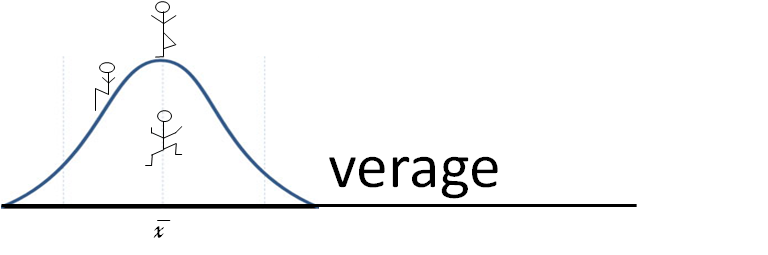

#AverageScript




Running on Javascript, _AverageScript_ is a combination of ECMAScript 6, Python, and Lua, with some random changes on the side. It was designed to increase efficiency, and also simply try out a few things to see how they look and feel when reading code. But enough about history, you're here for the language. Let's get started.

Here's some basic variable code:

```js

    let a = 70;                                  var a = 70;
    a++;                                         a++;
    let b = 60;                                  var b = 60;
    b += a;                                      b += a;
    let c = (a > b);                             var c = (a > b);
    let d = not c;                               var d = !c;
    c, d = d, c;                                 _1 = c, c = d, d = _1;

```

Just like in Javascript, _AverageScript_ is object oriented, and includes functions as objects.

```js

    let fib = func(a, amount)                    var fib = function(a, amount) {
        if(a === 0 or a === 1)                       if( a === 0 || a === 1 ) {
            ret amount;                                  return amount;
        end;                                         }
        ret fib(a - 1, amount * a);                  return fib(a - 1, amount * a);
    end;                                         }

    let z = fib(3, 1);                           var z = fib(3, 1);

    let Chicken = {                              var Chicken = {
        breed: "Bantam",                             breed: "Bantam",
        gender: "Male",                              gender: "Male",
        eggsLaid: 14,                                eggsLaid: 14,
        cry: func()                                  cry: function() {
            console.log("COCKADOODLEDOO!");              console.log("COCKADOODLEDOO!");
        end                                          }
    };                                           };

    let Circle = func(x, y, radius)              var Circle = function(x, y, radius) {
        self.x = x;                                  this.x = x;
        self.y = y;                                  this.y = y;
        self.radius = radius;                        this.radius = radius;
        self.setLocation = func(x, y)                this.setLocation = function(x, y) {
            self.x = x;                                  this.x = x;
            self.y = y;                                  this.y = y;
        end;                                         };
    end;                                         };

    let Dot = new Circle(0, 0, 5);               var Dot = new Circle(0, 0, 5);
    Dot["strokeIsDashed"] = true;                Dot["strokeIsDashed"] = true;
    Dot["color"] = "rgb(0,0,0)";                 Dot["color"] = "rgb(0,0,0)";
	
	let dotExample = Object.create(Dot);         var dotExample = Object.create(Dot);
	dotExample.radius = 50;                      dotExample.radius = 50;
    
    draw({                                       draw( {
        x: 6,                                        x: 6, 
        y: 10,                                       y: 10, 
        width: 50,                                   width: 50,
        height: 20,                                  height: 20,
        color: "red",                                color: "red", 
        size: 9,                                     size: 9,
        {                                            {
            stroke_style: "dashed",                      stroke_style: "dashed", 
            freq: 0.5,                                   freq: 0.5, 
            color: "red"                                 color: "red"
        }                                            }
     });                                         } );

````

Rather than `this`, _AverageScript_ uses `self` to specify the containing object.

An advantage of using _AverageScript_ (by design) is the capability skip unnecessary curly braces, but to still make clear where things start and end. However, semicolons help maintain clarity, so they remain.

Naturally, you can loop in _AverageScript_:

```js

    let c = false;                               var c = false;
    let list = [5, 7, 0];                        var list = [5, 7, 0];
    while( not c )                               while( !c )
        c = true;                                    c = true;
        for( i : list )                              for( var i = 0; i < list.length; i++ ) {
            if( x[i] > 0 )                               if( x[i] > 0 ) {                               
                x[i]--;                                      x[i]--;
            end;                                         }
            c = c and (x[i] === 0);                      c = c && (x[i] === 0);
        end;                                         }
    end;                                         }

```

Conditionals look a tad different, however.

```js

    let x = parseInt( input("Please enter a number") );                   var x = parseInt( input("Please enter a number") );   // input function is user defined.
    if( x > 0 )                                                           if( x > 0 ) {
        console.log("Feeling positive?");                                     console.log("Feeling positive?");
    maybe( x === 0 )                                                      } else if( x === 0 ) {
        console.log("Zero? Really?");                                         console.log("Zero? Really?");
    otherwise                                                             } else {
        console.log("Don't be so negative");                                  console.log("Don't be so negative");
    end;                                                                  }

```

Comments are casual.

```js

    let teascript = "Awesome";                                            var teascript = "Awesome";   // Variables should be declared with let.
    CoffeeScript = "Casual";                                              CoffeeScript = "Casual";     // Variables can be declared without let,
    $ = "$";                                                              $ = "$";                     // but its far less clear.

```


Minor notes:
* Camel Casing is preferred  
* Spacing norm is 4 spaces (NOT TABS)  
* Expect the average
* Not sure if you should use a semicolon? Use it
