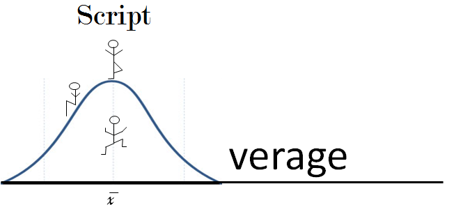

#AboveAverageScript

Running on Javascript, _AboveAverageScript_ is a combination of ECMAScript 6, Python, and Lua, with some random changes on the side. It was designed to increase efficiency, and also simply try out a few things to see how they look and feel when reading code.



<!--- 
Logo courtesy (in part) of https://averagechronicles.files.wordpress.com/2013/02/average-logo.png
-->

But enough about history, you're here for the language. Let's get started.

Here's some basic variable code:

```js

    let a = 70;                                  var a = 70;
    a++;                                         a++;
    let b = 60;                                  var b = 60;
    b += a;                                      b += a;
    let c = (a > b);                             var c = (a > b);
    let d = not c;                               var d = !c;
    c, d = d, c;                                 _1 = c, c = d, d = _1;

```

Just like in Javascript, _AboveAverageScript_ is object oriented, and includes functions as objects.

```js

    let fib = func(a, amount)                    var fib = function(a, amount) {
        if(a === 0 or a === 1)                       if( a === 0 || a === 1 ) {
            ret amount;                                  return amount;
        end;                                         }
        ret fib(a - 1, amount * a);                  return fib(a - 1, amount * a);
    end;                                         }

    let z = fib(3, 1);                           var z = fib(3, 1);

    let Chicken = {                              var Chicken = {
        breed: "Bantam",                             breed: "Bantam",
        gender: "Male",                              gender: "Male",
        eggsLaid: 14,                                eggsLaid: 14,
        cry: func()                                  cry: function() {
            log("COCKADOODLEDOO!");                      console.log("COCKADOODLEDOO!");
        end                                          }
    };                                           };

    let Circle = func(x, y, radius)              var Circle = function(x, y, radius) {
        _.x = x;                                     this.x = x;
        _.y = y;                                     this.y = y;
        _.radius = radius;                           this.radius = radius;
        _.setLocation = func(x, y)                   this.setLocation = function(x, y) {
            _['x', 'y'] = x, y;                          this['x'] = x, this['y'] = y;
        end;                                         };
    end;                                         };

    let Dot = new Circle(0, 0, 5);               var Dot = new Circle(0, 0, 5);
    Dot["strokeIsDashed", "color"] =             Dot["strokeIsDashed"] = true, Dot["color"] = "rgb(0,0,0)";
        true, "rgb(0,0,0)";                      
    
    let dotExample = Object.create(Dot);         var dotExample = Object.create(Dot);
    dotExample.radius = 50;                      dotExample.radius = 50;
    
    draw({                                       draw( {
        x: 6,                                        x: 6, 
        y: 10,                                       y: 10, 
        width: 50,                                   width: 50,
        height: 20,                                  height: 20,
        color: "red",                                color: "red", 
        size: 9,                                     size: 9,
        {                                            {
            stroke_style: "dashed",                      stroke_style: "dashed", 
            freq: 0.5,                                   freq: 0.5, 
            color: "red"                                 color: "red"
        }                                            }
     });                                         } );

````

Rather than `this`, _AboveAverageScript_ uses `_` to specify the containing object.

An advantage of using _AboveAverageScript_ (by design) is the capability skip unnecessary curly braces, but to still make clear where things start and end. However, semicolons help maintain clarity, so they remain.

Naturally, you can loop in _AboveAverageScript_:

```js

    let c = false;                               var c = false;
    let list = [5, 7, 0];                        var list = [5, 7, 0];
    while( not c )                               while( !c ) {
        c = true;                                    c = true;
        for( i in list )                              for( var i in list ) {
            if( x[i] > 0 )                               if( x[i] > 0 ) {                               
                x[i]--;                                      x[i]--;
            end;                                         }
            c = c and (x[i] === 0);                      c = c && (x[i] === 0);
        end;                                         }
    end;                                         }

```

Conditionals look a tad different, however.

```js

    let x = int( input("Please enter a number") );                        var x = int( input("Please enter a number") );   // input function is user defined.
    if( x > 0 )                                                           if( x > 0 ) {
        log("Feeling positive?");                                             console.log("Feeling positive?");
    elif( x === 0 )                                                       } else if( x === 0 ) {
        log("Zero? Really?");                                                 console.log("Zero? Really?");
    else                                                                  } else {
        log("Don't be so negative");                                          console.log("Don't be so negative");
    end;                                                                  }

```

Comments are casual.

```js

    let teascript = "Awesome";                                            var teascript = "Awesome";   // Variables should be declared with let.
    CoffeeScript = "Casual";                                              CoffeeScript = "Casual";     // Variables can be declared without let,
    $ = "$";                                                              $ = "$";                     // but its far less clear.
                            /* Multiline comments are also available! */

```

-

_Time for the new stuff._

To start things off, all objects can now be 'unpacked'.

```js

    let point = Circle.getCenter();              var point = Circle.getCenter();
    let x, y = point['x', 'y'];                  var x = point['x'], y = point['y'];

```

Unpacking can be thought of as a macro, however. Here's an example of why this is the case:

```js

    let dog = {                                  var dog = {
        sound: 'meow',                               sound: 'meow',
        makeSound: func()                            makeSound: function() {
            log(_.sound);                                console.log(this.sound);
        end,                                         },
        size: '0.5 lbs',                             size: '0.5 lbs',
        color: 'tan'                                 color: 'tan'
    };                                           };              
    dog['sound', 'size'] = 'woof', '50 lbs';     dog['sound'] = 'woof', dog['size'] = '50 lbs';

```

However, this can also be used to affect many properties in a compact manner:

```js

    let Rectangle = {                                                     var Rectangle = {                   
        x: 2,                                                                x: 2,
        y: 3,                                                                y: 3,
        width: 50,                                                           width: 50,
        height: 70                                                           height: 70
    };                                                                    };
    Rectangle['width', 'height'] *= 4;                                    Rectangle['width'] *= 4,  Rectangle['height'] *= 4;

    let words = ['compact', 'not as cool as TeaScript',                   var words = ['compact', 'not as cool as TeaScript', 
                 'I am going solo', 'I am Roald Dahl',                                 'I am going solo', 'I am Roald Dahl', 
                 'AboveAverageScript'];                                                'AboveAverageScript'];

    let sayings = [ "I am " + words[0, 1, 4] ];                           let sayings = [ "I am " + words[0], "I am " + words[1], "I am " + words[4] ];

```

Moving on. We've all used JQuery at one time or another. Well, since _AboveAverageScript_ creates a few built-in functions, they need to be placed somewhere. When using JQuery, the `$(function() { })` often proves helpful for ensuring your webpage loads quickly. Should you want these built-ins to be placed within your JQuery function, simply say `***native***`, and the compiler will know to place the built-ins there. Otherwise, they will just go to the top of your script.

```js

    $(function() {
        ***native***;
        log("Now you can use these built-ins in your code without slowing down your webpage!");
    });

```

As you may have noticed, 'this' and 'self' are missing. Well, that's because they're far too long. About 3 characters too long to be exact. Instead, 'this' is now '_'.

For now, the conventional Javascript regex creation is disabled, and one must use the Regex object to create regex. 

Here are the current (more pythonic) built-ins:

```js

    type(x)        // A replacement for typeof, function-ified.
    defaults(a, b) // A function that helps make default parameters. If a is defined, then it returns a. Otherwise, b is returned.
    int(x, base)   // A function that is a wrapper for the much more verbose parseInt function
    float(x)       // A function that is a wrapper for the much more verbose parseFloat function
    is(x, y)       // A replacement for instanceof, function-ified, translating into 'x instanceof y'
    log(x)         // A wrapper for console.log
    del(x, y)      // A replacement for delete, function-ified, translating into 'delete y[x]'

    // Finally, we have len. This is a special built-in that's rather adaptive to the situation.

    len(obj)       // len isn't simply a wrapper for obj.length. Actually, it looks for the length property in the object.
                   // If it isn't found, it instead returns a count of the enumerable properties in the object. Because of this,
                   // len actually encourages a universal length property for AVG programmers.

```

Last, but certainly not least, we have the new and improved for loops. 3 new types, all unique.

```js

    let y = ["true", "false", true, 0, 9, {}];

    // for..in -> iterates over property names of object
    for(x in y) log(x) end  // prints: 0, 1, 2, 3, 4, 5
    // so, for( x in y) translates directly into JS. Order is not guaranteed, however.

    // for..of -> iterates over property values of object
    for(x of y) log(x) end  // prints: "true", "false", true, 0, 9, {}
    // so, for(x of y) becomes for(x in y) { x = y[x] }; ...}


    // for..:  -> iterates over key-value pairs?
    for(x :  y) log(x) end  // prints: {key: 0, val:"true"}, {key:1, val:"false"}, {key:2, value:true}, {key:3, val:0}, {key:4, val:9}, {key:5, val:{}}
    // so, for(x : y) becomes for(x in y) { x = { key: x, val: y[x] }; ...user input... }

```

Minor notes:
* Camel Casing is preferred  
* Spacing norm is 4 spaces (NOT TABS)  
* Expect the (_ever so slighly_) above average
* Not sure if you should use a semicolon? Use it
